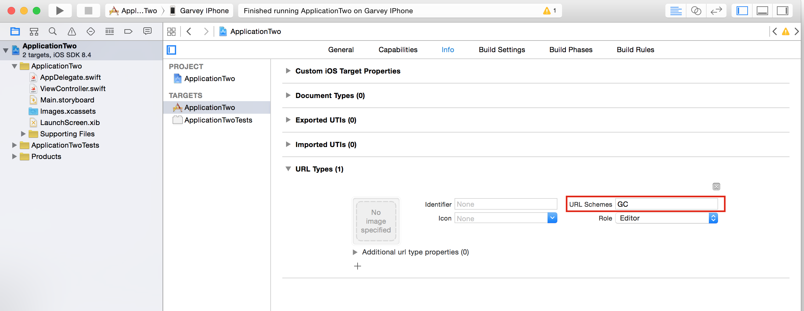

#Information

* Build: `Xcode7`
* language: `Swift 2.1`

#[iOS开发－应用之间的跳转及通信](http://www.cnblogs.com/GarveyCalvin/p/4877115.html)

## Update

2016-08-12: 在Github的[Demo](https://github.com/GarveyCalvin/ApplicationJumpAndSentValue)上增加Mac自定义Url Scheme，可以在Safari上输入特定协议头打开应用，并传递参数) - `Objective-C`

##简介

我们接下来将要实现应用程序之间的跳转及通讯。现在手机开发中，很多时候我们都需要在应用内跳转到别的应用中，这个是很常见的。为此，我们首先需要准备两个项目`ApplicationOne`和`ApplicationTwo`。([下载项目源码](https://github.com/GarveyCalvin/ApplicationJumpAndSentValue))

##应用间的简单跳转

在`ApplicationOne`应用跳转到`ApplicationTwo`应用

我们需要先创建在`ApplicationTwo`项目里设置`URL Types`协议，这里我设置为`GC`，如下所示



在`ApplicationOne`应用添加事件

```swift
@IBAction func openApplication() {
	// 1
    let urlSting = "GC://"
    // 2
    if let url = NSURL(string: urlSting) {
	    // 3
        let application = UIApplication.sharedApplication()
        // 4
        if application.canOpenURL(url) {
        // 5
            application.openURL(url)
        }
    }
}
```

* 1: 创建`urlString`字符串
* 2: 利用`urlString`字符串创建真正的`url`，并检测`url`是否有用
* 3: 获得`UIApplication`实例
* 4: 检测是否能够打开此`url`
* 5: 打开`url`，在这里即为我们的应用跳转

> 需要注意的是，协议开头必须要是完整的，即为`****://`

##应用间的传值跳转

实现方式很简单，我们只需要在`url`协议里补充参数就可以了，比如我现在传一个字符串`GarveyCalvin`

现在事件的代码是这样的

```swift
@IBAction func openApplication() {
    let urlSting = "GC://GarveyCalvin"
    if let url = NSURL(string: urlSting) {
        let application = UIApplication.sharedApplication()
        if application.canOpenURL(url) {
            application.openURL(url)
        }
    }
}
```

> 你可以在协议后补充`n`个参数，只需要双方都能解析得到就行，具体的协议规则自行商议

然后在`ApplicationTwo`应用的`AppDelegate`文件，我们需要实现如下方法去接收其它应用传进来的参数

```swift
func application(application: UIApplication, openURL url: NSURL, sourceApplication: String?, annotation: AnyObject?) -> Bool {
let newUrlHost: NSString = url.absoluteString ?? ""
let range = newUrlHost.rangeOfString("//")
    
if range.length != NSNotFound {
    let params = newUrlHost.substringFromIndex(range.length)
    UIAlertView(title: "params is \(params)", message: nil, delegate: nil, cancelButtonTitle: "Confirm").show()
} else {
    UIAlertView(title: "haven't params", message: nil, delegate: nil, cancelButtonTitle: "Confirm").show()
}
    
return false
}
```

##应用间的反向跳转

我们要实现的是，从`ApplicationOne`跳转到`ApplicationTwo`应用，再从`ApplicationTwo`跳转回`ApplicationOne`应用里。

具体的实现步骤如下：

* 我们需要在`ApplicationOne`项目中添加`URL Types`协议，具体看文章的上方，我们刚刚才做过。
* 为了实现应用间的反转跳转，我们必须让`ApplicationTwo`应用知道是从哪里跳转的，因此我们可以在`ApplicationOne `的`url`跳转事件把自身的`URL Types`协议传递给`ApplicationTwo`应用。像这样`GC://GarveyCalvin&GCFirst`
* 这样我们就能在`ApplicationTwo`应用的`application(_:openURL: sourceApplication:annotation:)`方法中获取到`ApplicationOne`的协议，我们保存它，等到需要反向跳转的时候就可以使用它来进行跳转了。

##适配iOS9

有一位Git友提醒了我，在`iOS9`下运行报以下错误（[issue](https://github.com/GarveyCalvin/ApplicationJumpAndSentValue/issues/1)）：

```
-canOpenURL: failed for URL: "GC://GarveyCalvin&GCFirst" - error: "This app is not allowed to query for scheme GC"
```

这是因为在`iOS9`中，苹果做了严格的限制，我们想要调起这个`url`，必须要手动添加白名单，这样苹果才会"放行"。我们需要在`info.plist`里添加

```
<key>LSApplicationQueriesSchemes</key>
<array>
	<string>GC</string>
</array>
```

> `LSApplicationQueriesSchemes`是一个数组，用于存放`url`白名单

##Download

你们可以通过这个Git的链接去下载本文章所使用的完整项目源码。([ApplicationJumpAndSentValue](https://github.com/GarveyCalvin/ApplicationJumpAndSentValue)).

####参考文章

---

[iOS开发拓展篇—应用之间的跳转和数据传递](http://www.cnblogs.com/wendingding/p/3972034.html)

[iOS应用程序开发之应用间的跳转](http://www.cnblogs.com/letougaozao/p/3979096.html)

[在Mac和iOS中注册自定义的URL Scheme](http://cocoa.venj.me/blog/custom-url-scheme-on-mac-and-ios/)

---
<br>

博文作者：GarveyCalvin<br>
博文出处：[http://www.cnblogs.com/GarveyCalvin/](http://www.cnblogs.com/GarveyCalvin/)<br>
本文版权归作者和博客园共有，欢迎转载，但须保留此段声明，并给出原文链接，谢谢合作！